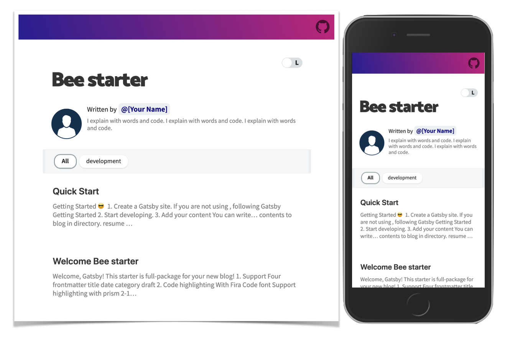
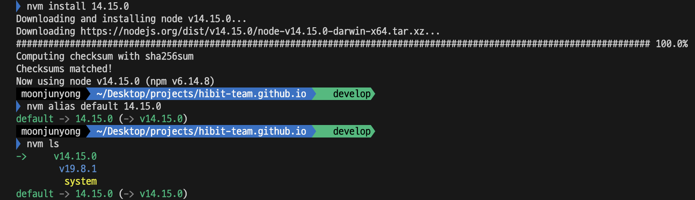
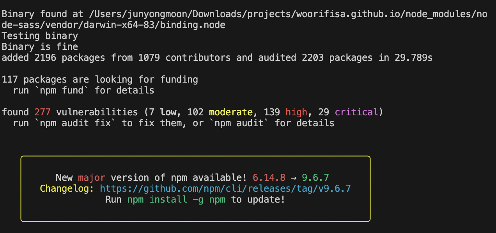
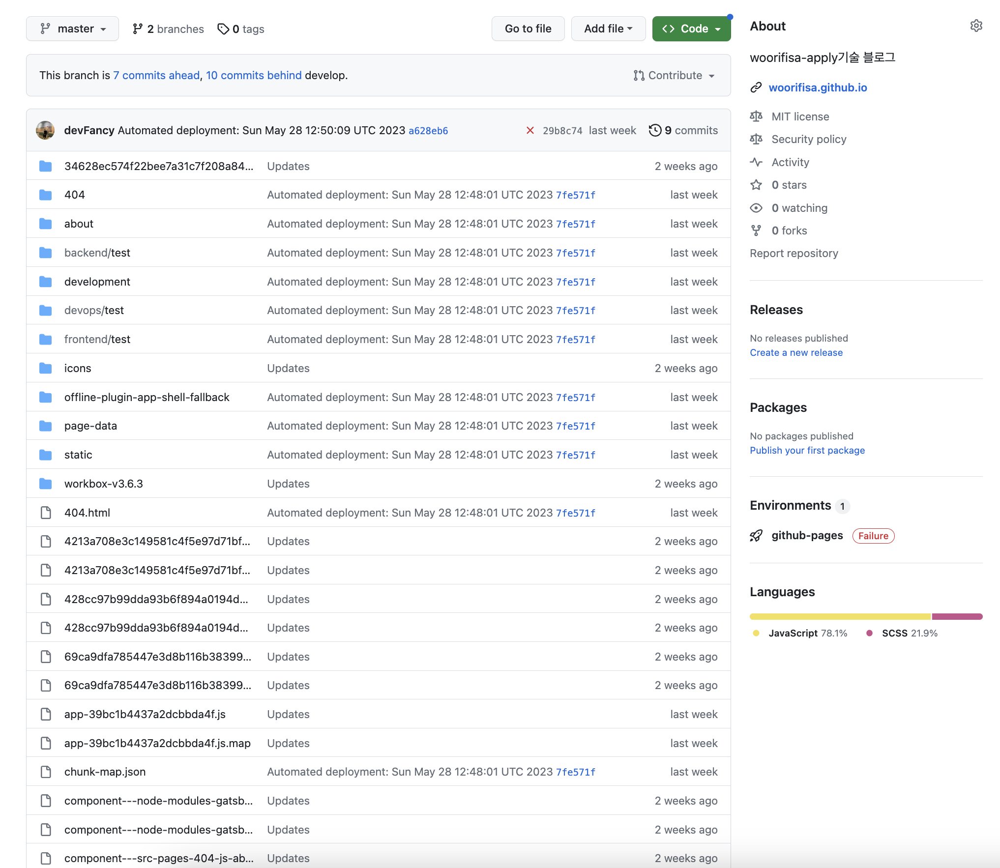
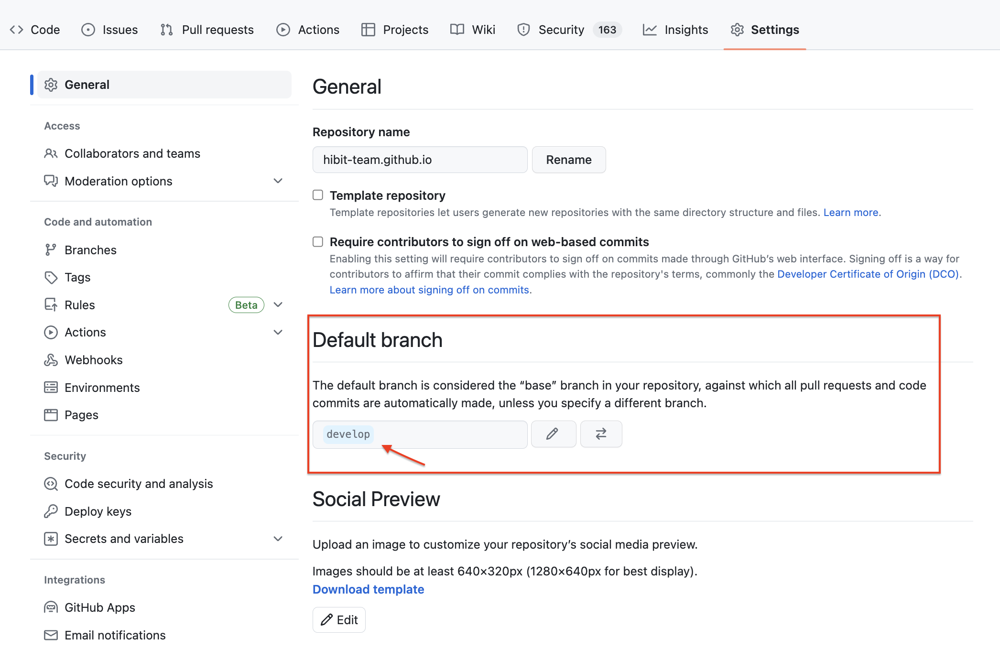
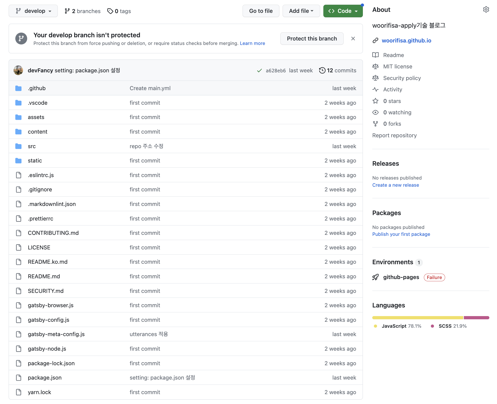

> 이 글은 Woorifsa-Apply팀 [푸린](https://github.com/purin48)님과 [팬시](https://github.com/devFancy)님이 작성했습니다.

## 팀 기술 블로그

- 이전까지 팀 프로젝트를 진행하면서, 한번도 프로젝트에 관한 기술 블로그를 작성한 적이 없었다.
- 팀 프로젝트를 진행하는 경우, **각자의 역할과 업무가 다르고 그에 맞는 기술들을 프로젝트에 적용**시키는 경우가 많다. 프로젝트를 진행했을 시점에는 내 업무가 아닌, 다른 사람의 업무가 궁금하다면 수시로 물어봐서 확인할 수 있다. 하지만, 프로젝트가 끝난 이후에는 요청하기가 선뜻 쉽지 않다.
- 팀 기술 블로그를 만든 이유는 간단하다. 팀 안에 속한 개발자들이 각자의 업무를 진행하면서 **어려운 문제들을 직면했을 때, 어떻게 해결했는지에 대한 과정**들을 기술 블로그를 통해 공유하는 목적이 크다.
- 서로간의 문제 해결 과정을 `공유`하면서 `함께 성장`하는 취지로 팀 기술 블로그를 만들게 되었다.

## Gastby 기반의 블로그 테마


> `Gastby`는 React를 기반으로 하며 최근 프론트엔드 시장에서 자주 등장하며 빠르게 성장하고 있는 **JAM Stack** 기반의 **정적 사이트 생성 프레임워크**이다.

### Gatsby를 사용하는 이유

1. React.js 기반의 프레임워크이다 : react를 어느 정도 다룰 줄 알면, 큰 어려움 없이 개발이 가능하다.

2. 성능이 좋다 : JavaScript가 실행되면 빈 HTML 페이지 안에 **마크업을 추가**해주는 일반적인 React SPA(Single Page Application)과는 다르게, 페이지 개발 후 Build를 하는 과정에서 마크업(.md)이 생성되기 때문에 일반 SPA 페이지보다 **빠르게 페이지를 랜더링**할 수 있다.

3. SEO에 유리하다 : 2번에서 말했던 대로 Build 과정에서 마크업이 생성되면서 페이지 내 모든 콘텐츠가 생성이 되어서 SPA과는 다르게 SEO(검색엔진최적화)에 유리하다. 다른 프레임워크 Next.js는 정적 사이트 생성의 기능도 있지만 주로 SSR(Server Side Rendering)을 사용하는 프레임워크다. 즉, 서버와 통신을 하며 요청을 받을 때마다 동적으로 웹 사이트를 생성하기 때문에 SEO에 불리하다는 단점이 있다.

### gastby-starter-bee

- 많은 Gatsby 기반의 블로그 테마()를 봐왔지만, 테마를 고르는 기준은 크게 2가지로 봤다.

  - 1. UI가 이쁘고 깔끔하면서, UX 관점에서 이동이 편리하다.
  - 2. 기술 블로그에 대한 설명이 어느 정도 있어야 한다.



- 그래서 [JaeYeopHan](https://github.com/JaeYeopHan)이 만드신 [Bee starter](https://gatsby-starter-bee.netlify.app/)를 사용하기로 했다.

## 사전 작업

> `Mac` 기반으로 설치했기 때문에, Windows는 다를 수 있다는 점을 유의해주시면 감사하겠습니다

- 우선, npm, node가 설치 되어 있어야 하며, 각 버전은 아래와 같이 설정해줘야 한다.

```shell
npm -v // 6.14.8
node -v // v14.15.0
```

- `nvm ls`로 현재 본인이 어느 버전에 해당하는 지 확인한다.



- 만약 node 버전이 `14.15.0`이 아니라면 아래와 같이 설치해서 default 해준다.

```shell
nvm uninstall 14 // node 버전이 14.15.0 이 아닌 다른 버전이 설치되어있는 경우 삭제하고 다시 설치한다.
arch -x86_64 zsh
nvm install 14
nvm alias default 14
```

## Install

### 1. Create a Gatsby site

```shell
npm install -g gatsby-cli
gatsby new woorifisa.github.io https://github.com/JaeYeopHan/gatsby-starter-bee
```

- 만약 설치가 안됐으면, 아래의 오류들을 마주하게 될 것이다.

> ERROR1. nvm 설치 오류

```shell
nvm --version
zsh: command not found: nvm
```

- bash shell에서는 nvm 명령어를 제대로 인식하지만, mac의 default shell인 zsh에서는 nvm을 인식하지 못하는 문제라고 한다.

- 이럴 경우, `zsh` 파일을 열어 아래 텍스트를 추가해준다.

- zsh 파일 열기

```shell
vi .zshrc
```

- 환경변수 추가하기

```shell
export NVM_DIR="$HOME/.nvm"
[ -s "$NVM_DIR/nvm.sh" ] && \. "$NVM_DIR/nvm.sh"
```

- 환경변수 추가한 뒤, 저장하고 나온다(`:wq`)

```shell
source ~/.zshrc
```

- 만약 `nvm --version`을 확인해도 안나온다면, zsh 파일을 다시 열고 아래의 코드를 추가한다.

```shell
vi .zshrc
```

```shell
export NVM_DIR=~/.nvm
source $(brew --prefix nvm)/nvm.sh
```

```shell
source ~/.zshrc
```

- 그런 다음, 다시 `nvm --version`을 확인하면 version이 `0.39` 대로 나오면 된다.

```shell
nvm --version // 0.39.0 혹은 0.39.3
```

> ERROR2. sharp error

- shrap error가 발생하면 아래와 같이 나온다.

```shell
npm ERR! code ELIFECYCLE
npm ERR! errno 1
npm ERR! sharp@0.32.1 install: `(node install/libvips && node install/dll-copy && prebuild-install) || (node install/can-compile && node-gyp rebuild && node install/dll-copy)`
npm ERR! Exit status 1
npm ERR!
npm ERR! Failed at the sharp@0.32.1 install script.
npm ERR! This is probably not a problem with npm. There is likely additional logging output above.

npm ERR! A complete log of this run can be found in:
npm ERR!     /Users/som/.npm/_logs/2023-05-20T09_03_58_512Z-debug.log
```

- 이런 경우, sharp 해당 버전을 설치하면 된다.

```shell
➜  ~ npm view sharp dist-tags.latest
0.32.1
➜  ~ npm install sharp@0.32.1
```

- `npm install` 명령어를 입력해서 정상적으로 설치되면 아래와 같은 화면이 나오게 된다.



#### 예외 사항

> 위의 에러 사항들 외에도 문제가 발생한다면, 기존의 npm의 cahce, node_modules, package-lock.json을 삭제하고 블로그 테마 주인이신 `JaeYeopHan`님이 만든 [gatsby-starter-bee](https://github.com/JaeYeopHan/gatsby-starter-bee)의 pacakage.json 파일을 복붙한다. 그리고 다시 `npm install` 한다.

### 2. Start developing

- 해당 폴더에 이동한 다음 `npm start` 명령어를 입력한다.

```shell
Error: EACCES: permission denied, open '/Users/som/.config/gatsby/config.json'
You don't have access to this file.

    at Object.openSync (fs.js:476:3)
    at Object.readFileSync (fs.js:377:35)
    at Configstore.get all [as all] (/Users/som/Desktop/coding/my-blog-starter/node_modules/configstore/index.js:34:25)
    at new Configstore (/Users/som/Desktop/coding/my-blog-starter/node_modules/configstore/index.js:27:13)
    at Object.getConfigStore (/Users/som/Desktop/coding/my-blog-starter/node_modules/gatsby-core-utils/dist/get-config-store.js:18:14)
    at Object.<anonymous> (/Users/som/Desktop/coding/my-blog-starter/node_modules/gatsby-recipes/src/providers/npm/package.js:12:24)
    at Module._compile (internal/modules/cjs/loader.js:1063:30)
    at Object.Module._extensions..js (internal/modules/cjs/loader.js:1092:10)
    at Module.load (internal/modules/cjs/loader.js:928:32)
    at Function.Module._load (internal/modules/cjs/loader.js:769:14)
```

- 빌드 과정에서 permission이 없어서 아래와 같이 발생한 문제라는 오류가 발생한다면, `chomd` 명령어를 통해 폴더별 권한을 변경한다.

```shell
sudo chmod -R 777 /Users/som/.config/gatsby/
```

- 그리고 다시 `npm start` 명령어를 입력해서 정상적으로 성공이 나오면, 아래와 같은 화면이 나온다.(localhost:8000)


### 3. Gatsby config 수정

- 설치가 완료되었으면, 이제 config에 있는 기본 값들을 바꾸면 된다.

> gatsby-meta-config.js 파일 수정

```javascript
module.exports = {
  title: `Woorifisa-Apply`,
  description: `Blog posted about ...`,
  author: `woorifisa-team`,
  introduction: `우리 FISA 교육생 지원서 관리 플랫폼 기술 블로그입니다.`,
  siteUrl: `https://woorifisa.github.io/`, // Your blog site url
  social: {
    github: `woorifisa/woorifisa.github.io/`, // Your GitHub account
  },
  icon: `content/assets/felog.png`, // Add your favicon
  keywords: [`blog`],
  comment: {
    disqusShortName: '', // Your disqus-short-name. check disqus.com.
    utterances: 'woorifisa/woorifisa.github.io/', // Your repository for archive comment
  },
  configs: {
    countOfInitialPost: 10, // Config your initial count of post
  },
  sponsor: {
    buyMeACoffeeId: 'devFancy',
  },
  share: {
    facebookAppId: '', // Add facebookAppId for using facebook share feature v3.2
  },
  ga: '0', // Add your google analytics tranking ID
  ad: '', // Add your google adsense publisherId `ca-pub-xxxxxxxxxx`
}
```

> package.json 수정

- scripts 내부에 `"deploy": ~~~` 추가한다. (참고로, github pages로 배포한다)

```json
{
  "name": "woorifisa",
  "private": true,
  "description": "woorifisa's github blog",
  "version": "0.1.0",
  "author": "fancy.junyongmoon@gmail.com",
  "bugs": {
    "url": "https://woorifisa.github.io/" // 깃허브 블로그 주소
  },
  // ... 중간 생략
  "scripts": {
    "post": "gatsby-post-gen",
    "dev": "gatsby develop",
    "lint": "eslint --ext .js,.jsx --ignore-pattern public .",
    "format": "prettier --trailing-comma es5 --no-semi --single-quote --write 'src/**/*.js' 'src/**/*.md'",
    "develop": "gatsby develop",
    "start": "npm run develop",
    "build": "gatsby build",
    "fix-semi": "eslint --quiet --ignore-pattern node_modules --ignore-pattern public --parser babel-eslint --no-eslintrc --rule '{\"semi\": [2, \"never\"], \"no-extra-semi\": [2]}' --fix gatsby-node.js",
    "deploy": "gatsby build && develop -d public -b master"
  }
}
```

- 이때 소스 코드 빌드 후의 public 폴더를 github `master` 브랜치에 push 한다는 의미이고, 이 소스코드로 `https://woorifisa.github.io/`에 배포한다는 의미이다.

### 4. deploy 하기

- 깃허브 repository 이름은 `woorifisa.github.io`으로 만들어 준다.

  - 만약, 개인 repository가 아닌 organization에서 만든 다면, origanization 이름과 일치해서 만들어줘야 한다.
  - e.g. github name: devfancy -> `devfancy.github.io`
  - e.g. organization name: woorifisa -> `woorifisa.github.io`

- 기술 블로그가 있는 폴더의 터미널에서 git을 세팅한다.

```shell
git init
git remote add origin https://github.com/woorifisa/woorifisa.github.io.git
```

- git 연동을 확인한다.

```shell
git remote -v
```

```
origin  https://github.com/hibit-team/hibit-team.github.io.git (fetch)
origin  https://github.com/hibit-team/hibit-team.github.io.git (push)
```

- add, commit, push

```shell
git add .
git commit -m "first commit"
git push origin master
# master or main 확인 꼭 할 것!
```

- 소스 코드가 제대로 업로드 되었다면, 배포 단계로 간다.

- deploy 명령어를 입력하기 전에 `gh-pages` 를 설치한다.

```shell
npm install -g gh-pages --save-dev
```

- 그리고 deploy 명령어를 입력한다.

```shell
npm run deploy
```

- 정상적으로 성공하면, 마지막에 `Published` 단어가 보인다.

- master 브랜치에 가보면, 아래와 같이 빌드된 파일들이 업로드 된 것을 확인할 수 있다.



### 5. 브랜치 분리(develop 생성)

- 배포는 develop 브랜치에서 하기 때문에 브랜치를 분리한다.

```shell
git branch develop
git checkout develop
```

- develop 브랜치에 수정한 코드 git에 올린다.

```shell
git add .
git commit -m “commit message”
git push -u origin develop
```

- 소스코드가 develop 브랜치에 잘 올라갔다면, github default 브랜치를 develop으로 바꿔준다.



- 그러면 develop 브랜치에서 업로드된 파일을 확인할 수 있다.



## Content - post 업로드

- 이제 설치도 끝났고, 배포도 되었으니 원하는 post를 만들어서 업로드하는 과정을 한다.

- 내용은 `content/blog` 폴더에 가면 있다.

- 새로운 post를 만드는 과정은 아래와 같다.

**Support script for creating new post**


```shell
npm run post
```

- post에 내용을 입력한 다음, github에 업로드하면 된다. (**주의**: 반드시 develop 브랜치에서 작업해야 함)

```shell
git add .
git commit -m "commit message"
git push origin develop
git run deploy
```

## 마치며..

- Gatsby 기반의 기술 블로그를 세팅하는 작업을 하며 다양한 오류들을 접하게 되면서, 해결하는 과정이 힘들었지만, 뒤돌아 생각해보면 많은 것을 배우게 되었다.

- Gatsby 기반 폴더 구조와 설치하는 과정을 알게 되었지만, 100% 이해는 못했다. 추후에 여유가 된다면 Gatsby에 대한 깊은 지식을 다뤄볼 예정이다.

- 추가적으로 배포에 대한 명령어를 수시로 입력해야 하는 상황을 **Github Action**을 활용하여 **배포 자동화**를 적용했는데, 해당 부분에 대한 설명은 추후에 업로드를 할 예정이다.

> 해당 기술 블로그 세팅 작업을 도와주신 [푸린](https://github.com/purin48)님께 이 자리를 빌어 감사의 말씀 전합니다.

## Reference

- [gastby-starter-bee/README.ko.md](https://github.com/JaeYeopHan/gatsby-starter-bee/blob/master/README.ko.md)

- [Gatsby를 어떻게 적용할 수 있을까?](https://blog.nerdfactory.ai/2022/06/24/setting-gatsby-with-typescript.html)

- [[React]zsh: command not found: nvm](https://velog.io/@energyy044/Reactzsh-command-not-found-nvm)

- [Can't install Sharp](https://stackoverflow.com/questions/54409953/cant-install-sharp)

- [npm install sharp error](https://velog.io/@juyoung810/npm-install-sharp-error)

- [Error case permission denied, open "gatsby/config.json"](https://superbderrick.tistory.com/308)

- [리눅스 chmod 명령어 사용법](https://recipes4dev.tistory.com/175)

- [gatsby설치, starter, meta data 설정](https://ha-young.github.io/2020/gatsby/make-blog/install-gatsby-select-starter/)
